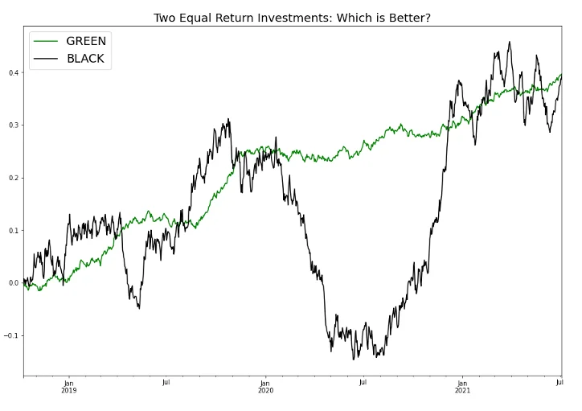

The following document serves as a way to document my own thought process towards constructing a portfolio starting with 100% cash. I am using this document to force myself to articulate in words why and how I am investing in the way I am, rather than just vibes.

## Investment Objectives

### Primary goals
These are non-negotiable.

> "The stock market is a device for transferring money from the impatient to the patient" — Warren Buffet

- Mostly buy and hold
    - I do not have the time to look at the market 24/7 and react to things
        - If I did anyway, I'd probably perform worse
    - I want to have an outlook where I cash out no earlier than 5 years from now
    - Also minimizes capital gains tax
- Beat the S&P500
    - This is what we will **benchmark** our portfolio against
    - If we can't beat the S&P500, what's the point?
        - I think the way to do this is through better sector allocations (not over investing in a particular sector), and by removing shittier companies... but more on that later
    - Note that this is extremely hard!!

### Secondary goals
These are great to have, but can be very difficult to achieve as a retail investor. Thus we try to get as close as possible, but understand we may not always reach these targets.

- Good risk-adjusted performance: Sharpe ratio of $\sim 0.8$
    - This is incredibly hard to do as a retail investor (we will probably not achieve this)
        - The overall thing to take away from here is to always be aware of risk, and to do our best to reduce it
    - _Sharpe ratio_ is just a calculation that tells you how smooth your returns are ([more info](https://www.investopedia.com/terms/s/sharperatio.asp))
        - Is a function of [_standard deviation_](#sec-std-dev)
    - Below shows two portfolios, green and black. They both started with the same amount, and ended with the same return. Which would you prefer?


::: {style="text-align: center;"}

:::

## Beliefs & Principles

### It's always a good time to invest

Despite how ugly things in the world may seem, it is difficult to argue against putting money into the market over a long enough period of a time ([source](https://www.macrotrends.net/datasets/1319/dow-jones-100-year-historical-chart)).

Try any of the presets, or choose your own dates:

```{=html}
<style>
  .date-inputs-row {
    display: flex;
    flex-direction: row;
    gap: 32px;
    align-items: flex-end;
  }
  .date-input-wrap {
    display: inline-flex;
    flex-direction: column;
    gap: 4px;
  }
  .date-label {
    font-size: 11px;
    font-weight: 600;
    text-transform: uppercase;
    letter-spacing: 0.08em;
    color: #888;
  }
  .date-input-wrap input[type="date"] {
    border: none;
    border-bottom: 2px solid steelblue;
    padding: 4px 2px;
    font-size: 15px;
    background: transparent;
    color: #222;
    outline: none;
    cursor: pointer;
    font-family: inherit;
    transition: border-color 0.2s;
  }
  .date-input-wrap input[type="date"]:focus {
    border-bottom-color: #1a3f5c;
  }
  .preset-btns {
    display: flex;
    gap: 8px;
    margin-bottom: 14px;
  }
  .preset-btn {
    border: 1.5px solid steelblue;
    background: transparent;
    color: steelblue;
    border-radius: 4px;
    padding: 4px 12px;
    font-size: 13px;
    cursor: pointer;
    font-family: inherit;
    transition: background 0.15s, color 0.15s;
  }
  .preset-btn:hover {
    background: steelblue;
    color: #fff;
  }
  .index-toggle {
    display: flex;
    gap: 8px;
    margin-bottom: 16px;
  }
  .index-btn {
    border: 1.5px solid steelblue;
    background: transparent;
    color: steelblue;
    border-radius: 4px;
    padding: 4px 14px;
    font-size: 13px;
    cursor: pointer;
    font-family: inherit;
    transition: background 0.15s, color 0.15s;
  }
  .index-btn.active, .index-btn:hover {
    background: steelblue;
    color: #fff;
  }
</style>
```

```{ojs}
dji = {
  const res = await fetch("data/DJI-100y.csv");
  const text = await res.text();
  return text.trim().split('\n').slice(1).map(row => {
    const cols = row.split(',');
    const rawDate = cols[0].replace(/"/g, '');
    const [month, day, year] = rawDate.split('/');
    return { date: new Date(`${year}-${month}-${day}`), value: +cols[1] };
  });
}

sp500 = {
  const res = await fetch("data/SP500-1927-2019.csv");
  const text = await res.text();
  return text.trim().split('\n').slice(1).map(row => {
    const cols = row.split(',');
    return { date: new Date(cols[0]), value: +cols[4] };
  });
}

function dateInput(label, value) {
  const wrap = html`<div class="date-input-wrap">
    <span class="date-label">${label}</span>
    <input type="date" value="${value}" min="1914-12-31" max="2026-03-27">
  </div>`;
  const input = wrap.querySelector("input");
  wrap.value = new Date(input.value);
  input.addEventListener("change", () => {
    wrap.value = new Date(input.value);
    wrap.dispatchEvent(new Event("input", { bubbles: true }));
  });
  return wrap;
}

events = [
  { date: new Date("1929-10-28"), name: "Black Tuesday", detail: "Dow drops −23.6% in 2 days" },
  { date: new Date("1932-07-08"), name: "Great Depression bottom", detail: "−89% from the 1929 peak" },
  { date: new Date("1933-03-01"), name: "Peak unemployment", detail: "US unemployment reaches 25%" },
  { date: new Date("1939-09-01"), name: "WWII begins", detail: "Germany invades Poland" },
  { date: new Date("1940-09-07"), name: "The Blitz begins", detail: "Germany begins bombing Britain" },
  { date: new Date("1941-12-07"), name: "Pearl Harbor", detail: "US enters WWII" },
  { date: new Date("1950-06-25"), name: "Korean War begins", detail: "N. Korea invades S. Korea" },
  { date: new Date("1962-10-16"), name: "Cuban Missile Crisis", detail: "13 days on the brink of nuclear war" },
  { date: new Date("1963-11-22"), name: "JFK Assassinated", detail: "NYSE halts trading" },
  { date: new Date("1964-08-07"), name: "Gulf of Tonkin", detail: "US escalates into Vietnam War" },
  { date: new Date("1968-12-03"), name: "Vietnam bear market begins", detail: "Dow falls ~35% over 18 months" },
  { date: new Date("1970-05-26"), name: "Vietnam bear market bottom", detail: "−35% from Dec 1968 peak" },
  { date: new Date("1971-08-15"), name: "Nixon ends gold standard", detail: "US abandons Bretton Woods; inflation unleashed" },
  { date: new Date("1973-10-17"), name: "Oil embargo begins", detail: "Stagflation; Dow drops ~45%" },
  { date: new Date("1980-03-01"), name: "Inflation peaks at 14.8%", detail: "Fed raises rates to 20%" },
  { date: new Date("1981-09-30"), name: "10-year Treasury hits 15.8%", detail: "Bonds crush stocks in appeal" },
  { date: new Date("1981-10-09"), name: "30-year mortgage hits 18.45%", detail: "Housing market freezes" },
  { date: new Date("1987-10-19"), name: "Black Monday", detail: "Dow drops 22.6% in a single day" },
  { date: new Date("1990-08-02"), name: "Gulf War begins", detail: "Iraq invades Kuwait; Dow -20%" },
  { date: new Date("1997-10-27"), name: "Asian financial crisis", detail: "Dow drops ~13% in a week" },
  { date: new Date("1998-08-17"), name: "Russia debt default", detail: "LTCM collapse; Fed intervenes" },
  { date: new Date("2000-03-10"), name: "Dot-com bubble bursts", detail: "NASDAQ falls 78% peak to trough" },
  { date: new Date("2008-03-14"), name: "Bear Stearns rescued", detail: "JPMorgan buys for $2/share; first 2008 domino" },
  { date: new Date("2008-09-15"), name: "Lehman Brothers collapse", detail: "Dow loses 54% peak to trough" },
  { date: new Date("2008-09-17"), name: "AIG bailout", detail: "Fed bails out AIG for $85B" },
  { date: new Date("2011-08-05"), name: "US credit downgraded", detail: "S&P cuts US from AAA to AA+" },
  { date: new Date("2011-07-01"), name: "Eurozone debt crisis", detail: "Greece near default" },
  { date: new Date("2013-05-22"), name: "Taper tantrum", detail: "Fed hints at QE tapering" },
  { date: new Date("2014-06-01"), name: "Oil price crash", detail: "Oil falls from $100 to <$30" },
  { date: new Date("2001-09-11"), name: "9/11", detail: "NYSE closed 4 days; Dow -7.1% on reopening" },
  { date: new Date("2002-10-09"), name: "Dot-com bear market bottom", detail: "Dow down 38% from 2000 peak" },
  { date: new Date("2009-03-09"), name: "2008 bear market bottom", detail: "Dow hits 6,547; -54% from 2007 peak" },
  { date: new Date("2015-08-24"), name: "China market crash", detail: "Shanghai -40%; global selloff" },
  { date: new Date("2020-02-20"), name: "COVID-19 crash", detail: "Fastest 30% Dow drop in history" },
  { date: new Date("2022-01-03"), name: "Fed rate hike bear market", detail: "Aggressive hikes to fight inflation; Dow -20%" },
  { date: new Date("2025-04-02"), name: "Liberation Day tariffs", detail: "Trump tariff announcement; sharp market selloff" },
]

{
  let state = {
    dateRange: { start: new Date("1925-01-01"), end: new Date("1955-12-31") },
    index: "DJI",
  };

  // --- Controls ---
  const startInput = dateInput("From", "1925-01-01");
  const endInput   = dateInput("To",   "1955-12-31");

  const presets = [
    { label: "1926 – 1955", from: "1926-01-01", to: "1955-12-31" },
    { label: "1956 – 1985", from: "1956-01-01", to: "1985-12-31" },
    { label: "1986 – 2015", from: "1986-01-01", to: "2015-12-31" },
  ];

  function applyPreset(from, to) {
    const si = startInput.querySelector("input");
    const ei = endInput.querySelector("input");
    si.value = from; si.dispatchEvent(new Event("change", { bubbles: true }));
    ei.value = to;   ei.dispatchEvent(new Event("change", { bubbles: true }));
  }

  const presetBtns = html`<div class="preset-btns">${presets.map(p => {
    const b = html`<button class="preset-btn">${p.label}</button>`;
    b.addEventListener("click", () => applyPreset(p.from, p.to));
    return b;
  })}</div>`;

  startInput.addEventListener("input", () => {
    state.dateRange = { ...state.dateRange, start: startInput.value };
    render();
  });
  endInput.addEventListener("input", () => {
    state.dateRange = { ...state.dateRange, end: endInput.value };
    render();
  });

  const indexOptions = ["DJI", "S&P 500", "Both"];
  const indexBtns = indexOptions.map(opt => {
    const b = html`<button class="index-btn${opt === state.index ? " active" : ""}">${opt}</button>`;
    b.addEventListener("click", () => {
      state.index = opt;
      indexToggle.querySelectorAll(".index-btn").forEach(btn => btn.classList.remove("active"));
      b.classList.add("active");
      render();
    });
    return b;
  });
  const indexToggle = html`<div class="index-toggle">${indexBtns}</div>`;

  const chartDiv = html`<div></div>`;

  function render() {
    const { dateRange, index } = state;
    const filteredDJI = dji.filter(d => d.date >= dateRange.start && d.date <= dateRange.end);
    const filteredSP  = sp500.filter(d => d.date >= dateRange.start && d.date <= dateRange.end);
    const visibleEvts = events.filter(e => e.date >= dateRange.start && e.date <= dateRange.end);

    let plotData;
    if (index === "DJI") plotData = filteredDJI.map(d => ({ ...d, series: "DJI" }));
    else if (index === "S&P 500") plotData = filteredSP.map(d => ({ ...d, series: "S&P 500" }));
    else {
      const djiBase = filteredDJI[0]?.value ?? 1, spBase = filteredSP[0]?.value ?? 1;
      plotData = [
        ...filteredDJI.map(d => ({ date: d.date, value: d.value / djiBase, series: "DJI" })),
        ...filteredSP.map(d => ({ date: d.date, value: d.value / spBase, series: "S&P 500" })),
      ];
    }

    const yearRange = `${dateRange.start.getFullYear()} – ${dateRange.end.getFullYear()}`;

    let endLabels;
    if (index === "Both") {
      const djiSeries = plotData.filter(d => d.series === "DJI");
      const spSeries  = plotData.filter(d => d.series === "S&P 500");
      const djiLast = djiSeries.at(-1), spLast = spSeries.at(-1);
      const yRange = Math.max(...plotData.map(d => d.value)) - Math.min(...plotData.map(d => d.value));
      const close = Math.abs(djiLast.value - spLast.value) < yRange * 0.05;
      endLabels = [
        { ...djiLast, pct: ((djiLast.value - 1) * 100).toFixed(2), dyOffset: close ? -10 : 0 },
        { ...spLast,  pct: ((spLast.value  - 1) * 100).toFixed(2), dyOffset: close ?  10 : 0 },
      ];
    } else {
      const first = plotData[0], last = plotData.at(-1);
      endLabels = first && last ? [{ ...last, pct: ((last.value / first.value - 1) * 100).toFixed(2) }] : [];
    }

    const titleText = index === "Both"
      ? `Reasons not to invest — DJI vs S&P 500 (${yearRange})`
      : index === "DJI"
        ? `Reasons not to invest — Dow Jones (${yearRange})`
        : `Reasons not to invest — S&P 500 (${yearRange})`;

    function sharpe(data) {
      if (data.length < 2) return null;
      const rets = data.slice(1).map((d, i) => (d.value - data[i].value) / data[i].value);
      const mean = rets.reduce((a, b) => a + b, 0) / rets.length;
      const std = Math.sqrt(rets.reduce((a, b) => a + (b - mean) ** 2, 0) / rets.length);
      return ((mean / std) * Math.sqrt(12)).toFixed(2);
    }

    const sharpeEl = index === "Both"
      ? html`<p style="font-size:13px; color:#666; margin:2px 0 8px;">
          Sharpe ratio — <span style="color:steelblue;">DJI: ${sharpe(filteredDJI)}</span>
          &nbsp;·&nbsp;
          <span style="color:darkorange;">S&P 500: ${sharpe(filteredSP)}</span>
          <span style="color:#aaa; font-size:11px;"> (annualized, assumes 0% risk-free rate)</span>
        </p>`
      : html`<p style="font-size:13px; color:#666; margin:2px 0 8px;">
          Sharpe ratio: <strong>${sharpe(index === "DJI" ? filteredDJI : filteredSP)}</strong>
          <span style="color:#aaa; font-size:11px;"> (annualized, assumes 0% risk-free rate)</span>
        </p>`;

    const plot = Plot.plot({
      width: 800, height: 400, marginRight: 100, marginTop: 40, marginLeft: 80,
      color: { legend: index === "Both", domain: ["DJI", "S&P 500"], range: ["steelblue", "darkorange"] },
      x: { type: "time", label: "Date" },
      y: { label: index === "Both" ? "Growth multiple" : "Value (USD)", tickFormat: index === "Both" ? d => d + "x" : d => "$" + d.toLocaleString(), grid: true },
      marks: [
        Plot.lineY(plotData, { x: "date", y: "value", stroke: index === "Both" ? "series" : "steelblue", strokeWidth: 1.5 }),
        Plot.dot(endLabels, { x: "date", y: "value", fill: d => +d.pct >= 0 ? "green" : "red", r: 4 }),
        Plot.text(endLabels, { x: "date", y: "value", text: d => `${+d.pct >= 0 ? "+" : ""}${d.pct}%`, fill: d => +d.pct >= 0 ? "green" : "red", dx: 8, dy: d => d.dyOffset ?? 0, textAnchor: "start", fontWeight: "bold", fontSize: 13 }),
        Plot.ruleX(visibleEvts, { x: "date", stroke: "crimson", strokeDasharray: "4,3", strokeOpacity: 0.7, tip: true, channels: { Event: d => d.name, Detail: d => d.detail } }),
        Plot.text(visibleEvts, { x: "date", text: () => "▼", frameAnchor: "top", lineAnchor: "bottom", fontSize: 14, fill: "crimson" }),
        Plot.tip(plotData, Plot.pointerX({ x: "date", y: "value", title: d => index === "Both" ? `${d.series}: ${d.value.toFixed(2)}x` : d.value.toLocaleString() })),
        Plot.ruleY([0]),
      ],
    });

    chartDiv.innerHTML = "";
    chartDiv.append(
      html`<p style="font-size:15px; color:#444; font-weight:600; margin:0 0 2px;">${titleText}</p>`,
      sharpeEl,
      plot,
    );
  }

  render();

  return html`<div style="background:#fff;border:1px solid #ddd;border-radius:4px;padding:20px 24px 14px;margin:16px 0;">
    ${presetBtns}
    <div class="date-inputs-row" style="margin-bottom:16px;">${startInput}${endInput}</div>
    ${indexToggle}
    ${chartDiv}
  </div>`;
}
```

## Strategic Allocation

> "Asset Allocation is more than 100% of an Investment Portfolio's Performance" — David Swensen, CIO of Yale's Endowment; widely considered the GOAT of institutional investing

> "If I'm an investor, the most important thing you can have is a good strategic allocation mix" — Ray Dalio, CIO and Founder of Bridgewater Associates

With our main objective being to maximize our risk-adjusted returns, we'll need to do a handful of things, including:

- Define our asset classes
- Select our indices

Afterwards, we will calculate the risk and reward of our portfolio comprised of our selected asset classes, via the following metrics:

- Return of each asset class
- Risk of each asset class
    - We use [_standard deviation_](#sec-std-dev) as our primary measure of risk
    - We can also use _maximum drawdown_ as another metric
- Correlation of the asset classes
    - We want our asset classes to have low correlation with one another
        - If one asset drops, we want our other assets to either be unaffected or increase, with the overall effect being that we reduce the volatility of our portfolio
            - This is the [mathematical basis behind _diversification_](#sec-diversification)
        - Note that during 'tail events' (like a crisis), these assumptions of assets being lowly correlated to each other tend to not hold (e.g. a massive sell-off)

The graphs below illustrate how combining two negatively correlated assets result in a much less risky portfolio:

```{=html}
<div style="background:#fff;border:1px solid #ddd;border-radius:4px;padding:20px 24px 14px;margin:16px 0;font-family:'Arial Black',sans-serif;">
  <div class="preset-btns" style="margin-bottom:16px;">
    <button class="preset-btn active" id="btn-corr" onclick="setCorr(true)">High Correlation (r ≈ +1)</button>
    <button class="preset-btn" id="btn-neg" onclick="setCorr(false)">Inverse Correlation (r ≈ −1)</button>
  </div>
    <div id="corr-title" style="font-size:16px;font-weight:900;text-transform:uppercase;letter-spacing:0.5px;line-height:1.3;margin-bottom:12px;color:#1a1a2e;">
      PORTFOLIO WITH <span style="color:#E8A020;">HIGHLY CORRELATED</span> ASSETS
    </div>
    <svg id="combo-chart" viewBox="0 0 720 260" style="display:block;width:100%;background:#fafafa;border:1px solid #e8e8e8;"></svg>
    <div style="display:flex;gap:20px;margin-top:10px;flex-wrap:wrap;align-items:center;font-family:Georgia,serif;font-size:13px;">
      <div style="display:flex;align-items:center;gap:6px;color:#444;"><div style="width:24px;height:3px;background:#E8A020;border-radius:2px;"></div>Asset A</div>
      <div style="display:flex;align-items:center;gap:6px;color:#444;"><div style="width:24px;height:3px;background:#CC2233;border-radius:2px;"></div>Asset B</div>
      <div style="display:flex;align-items:center;gap:6px;color:#222;font-weight:700;"><div style="width:28px;height:4px;background:#38C8E8;border-radius:2px;"></div>Portfolio (equal weight)</div>
      <div style="margin-left:auto;color:#888;font-style:italic;">Correlation: <strong id="corr-label" style="color:#1a1a2e;">≈ +1.00</strong></div>
    </div>
</div>
<script>
(function(){
  const W=720,H=260,PL=28,PR=28,PT=20,PB=24,N=200;
  const cW=W-PL-PR, cH=H-PT-PB;
  function wave(freq,phase,amp,drift,noise){
    return Array.from({length:N},(_,i)=>{
      const t=i/(N-1);
      return Math.sin(2*Math.PI*freq*t+phase)*amp
           + Math.sin(2*Math.PI*freq*1.7*t+phase*1.3)*amp*0.35
           + drift*t
           + noise*Math.sin(i*7.3+phase*3)*0.3;
    });
  }
  function path(vals,gMin,gMax){
    return vals.map((v,i)=>`${i?'L':'M'}${(PL+i/(N-1)*cW).toFixed(1)},${(PT+(1-(v-gMin)/(gMax-gMin))*cH).toFixed(1)}`).join(' ');
  }
  function render(a,b){
    const port=a.map((v,i)=>(v+b[i])/2);
    const all=[...a,...b,...port];
    const pad=0.08*(Math.max(...all)-Math.min(...all));
    const lo=Math.min(...all)-pad, hi=Math.max(...all)+pad;
    const svg=document.getElementById('combo-chart');
    let h='';
    for(let i=1;i<=4;i++) h+=`<line x1="${PL}" y1="${PT+i/5*cH}" x2="${W-PR}" y2="${PT+i/5*cH}" stroke="#e0e0e0" stroke-width="1"/>`;
    h+=`<path d="${path(a,lo,hi)}" fill="none" stroke="#E8A020" stroke-width="2.5" stroke-linecap="round" stroke-linejoin="round"/>`;
    h+=`<path d="${path(b,lo,hi)}" fill="none" stroke="#CC2233" stroke-width="2.5" stroke-linecap="round" stroke-linejoin="round"/>`;
    h+=`<path d="${path(port,lo,hi)}" fill="none" stroke="#38C8E8" stroke-width="4" stroke-linecap="round" stroke-linejoin="round"/>`;
    svg.innerHTML=h;
  }
  const aWave = wave(1.4,0,0.8,0.4,0.15);
  window.setCorr = function(high){
    const b = high ? wave(1.4,0.18,0.8,0.4,0.15) : wave(1.4,Math.PI,0.8,0.4,0.15);
    render(aWave, b);
    document.getElementById('corr-label').textContent = high ? '≈ +1.00' : '≈ −1.00';
    document.getElementById('corr-title').innerHTML = high
      ? 'PORTFOLIO WITH <span style="color:#E8A020;">HIGHLY CORRELATED</span> ASSETS'
      : 'PORTFOLIO WITH <span style="color:#E8A020;">NEGATIVELY CORRELATED</span> ASSETS';
    document.getElementById('btn-corr').classList.toggle('active', high);
    document.getElementById('btn-neg').classList.toggle('active', !high);
  };
  setCorr(true);
})();
</script>
```

For a mathematical explanation, [click here](#sec-diversification).

### How should I allocate my portfolio?

We can use the legendary book _A Random Walk Down Wall Street_ to get a starting point on how to allocate our portfolio:

```{ojs}
{
  const allData = {
    "Mid 20s": [
      { label: "Stocks",               value: 70, color: "steelblue",  note: "One-half in U.S. stocks with good representation of smaller growth companies, one-half international stocks, including emerging markets." },
      { label: "Bonds & Bond Subs.",   value: 15, color: "darkorange", note: "No-load high-grade corporate bond fund, some Treasury inflation protection securities, foreign bonds, dividend growth stocks." },
      { label: "Real Estate",          value: 10, color: "seagreen",   note: "Portfolio of REITs." },
      { label: "Cash",                 value: 5,  color: "#aaa",       note: "Money-market fund or short-term bond fund (average maturity 1 to 1½ years)." },
    ],
    "Late 30s – Early 40s": [
      { label: "Stocks",               value: 65, color: "steelblue",  note: "One-half in U.S. stocks with good representation of smaller growth companies, one-half international stocks, including emerging markets." },
      { label: "Bonds & Bond Subs.",   value: 20, color: "darkorange", note: "No-load high-grade corporate bond fund, some Treasury inflation protection securities, foreign bonds, dividend growth stocks." },
      { label: "Real Estate",          value: 10, color: "seagreen",   note: "Portfolio of REITs." },
      { label: "Cash",                 value: 5,  color: "#aaa",       note: "Money-market fund or short-term bond fund (average maturity 1 to 1½ years)." },
    ],
    "Mid-Fifties": [
      { label: "Stocks",               value: 55,   color: "steelblue",  note: "One-half in U.S. stocks with good representation of smaller growth companies, one-half international stocks, including emerging markets." },
      { label: "Bonds & Bond Subs.",   value: 27.5, color: "darkorange", note: "No-load high-grade corporate bond fund, some Treasury inflation protection securities, foreign bonds, dividend growth stocks." },
      { label: "Real Estate",          value: 12.5, color: "seagreen",   note: "Portfolio of REITs." },
      { label: "Cash",                 value: 5,    color: "#aaa",       note: "Money-market fund or short-term bond fund (average maturity 1 to 1½ years)." },
    ],
    "Late 60s & Beyond": [
      { label: "Stocks",               value: 40, color: "steelblue",  note: "One-half in U.S. stocks with good representation of smaller growth companies; one-half international stocks, including emerging markets." },
      { label: "Bonds & Bond Subs.",   value: 35, color: "darkorange", note: "No-load high-grade corporate bond fund, some Treasury inflation protection securities, foreign bonds, dividend growth stocks." },
      { label: "Real Estate",          value: 15, color: "seagreen",   note: "Portfolio of REITs." },
      { label: "Cash",                 value: 10, color: "#aaa",       note: "Money-market fund or short-term bond fund (average maturity 1 to 1½ years)." },
    ],
  };

  const descriptions = {
    "Mid 20s":               "Lifestyle: Fast, aggressive. With a steady stream of earnings, capacity for risk is fairly high. Need discipline of payroll savings to build nest egg.",
    "Late 30s – Early 40s": "Lifestyle: Midlife crisis. For childless career couples, capacity for risk is still quite high. Risk options vanishing for those with college tuitions looming.",
    "Mid-Fifties":           "Lifestyle: Many still reeling from college tuitions. No matter what the lifestyle, this age group must start thinking about retirement and the need for income protection.",
    "Late 60s & Beyond":    "Lifestyle: Enjoying leisure activities but also guarding against major health costs. Little or no capacity for risk.",
  };

  const options = Object.keys(allData);
  let currentAge = options[0];

  function renderSVG(age) {
    const data = allData[age];
    const noteWidth = 400;
    const hasNotes = data.some(d => d.note);
    const itemHeight = hasNotes ? 88 : 28;
    const radius = 110;
    const legendX = radius * 2 + 48;
    const legendHeight = data.length * itemHeight;
    const descHeight = 48;
    const height = Math.max(radius * 2, legendHeight) + descHeight;
    const width = legendX + noteWidth + 16;
    const pieX = radius + 20, pieY = descHeight + (height - descHeight) / 2;

    const pie = d3.pie().value(d => d.value).sort(null)(data);
    const arc = d3.arc().innerRadius(0).outerRadius(radius);

    const svg = d3.create("svg")
      .attr("viewBox", `0 0 ${width} ${height}`)
      .attr("width", width)
      .attr("height", height);

    svg.append("foreignObject")
      .attr("x", 0).attr("y", 0).attr("width", width).attr("height", descHeight)
      .append("xhtml:div")
      .style("font-size", "12px").style("color", "#555").style("line-height", "1.5")
      .style("font-family", "inherit").style("font-style", "italic")
      .text(descriptions[age]);

    const g = svg.append("g").attr("transform", `translate(${pieX},${pieY})`);

    g.selectAll("path").data(pie).join("path")
      .attr("d", arc).attr("fill", d => d.data.color)
      .attr("stroke", "white").attr("stroke-width", 2);

    const labelArc = d3.arc().innerRadius(radius * 0.6).outerRadius(radius * 0.6);
    g.selectAll("text.slice-label").data(pie).join("text")
      .attr("class", "slice-label")
      .attr("transform", d => `translate(${labelArc.centroid(d)})`)
      .attr("text-anchor", "middle").attr("dominant-baseline", "middle")
      .attr("font-size", 12).attr("fill", "white").attr("font-weight", "bold")
      .text(d => `${d.data.value}%`);

    const legendStartY = descHeight + (height - descHeight) / 2 - legendHeight / 2;
    const legend = svg.append("g").attr("transform", `translate(${legendX}, ${legendStartY})`);
    const legendItem = legend.selectAll("g").data(data).join("g")
      .attr("transform", (d, i) => `translate(0, ${i * itemHeight})`);

    legendItem.append("rect").attr("width", 14).attr("height", 14).attr("rx", 2).attr("fill", d => d.color);
    legendItem.append("text").attr("x", 20).attr("y", 11)
      .attr("font-size", 13).attr("font-weight", "600").attr("fill", "#222")
      .text(d => `${d.label} — ${d.value}%`);
    legendItem.filter(d => d.note).append("foreignObject")
      .attr("x", 20).attr("y", 20).attr("width", noteWidth).attr("height", itemHeight - 22)
      .append("xhtml:div")
      .style("font-size", "11px").style("color", "#888").style("line-height", "1.45")
      .style("font-family", "inherit").text(d => d.note);

    return svg.node();
  }

  const chartDiv = html`<div></div>`;
  chartDiv.appendChild(renderSVG(currentAge));

  const buttons = options.map(opt => {
    const b = html`<button class="index-btn${opt === currentAge ? " active" : ""}">${opt}</button>`;
    b.addEventListener("click", () => {
      currentAge = opt;
      wrapper.querySelectorAll(".index-btn").forEach(btn => btn.classList.remove("active"));
      b.classList.add("active");
      chartDiv.innerHTML = "";
      chartDiv.appendChild(renderSVG(opt));
    });
    return b;
  });

  const wrapper = html`<div style="background:#fff;border:1px solid #ddd;border-radius:4px;padding:20px 24px 0px;margin:16px 0;">
    <div class="index-toggle">${buttons}</div>
    ${chartDiv}
  </div>`;

  return wrapper;
}
```

This allocation also closely resembles that of the **LifePath** funds (commonly offered in 401k plans).

### The S&P 500 over-allocation problem

## Constraints

- I am assuming to inject a fixed amount ($\sim \$500 – \$750$) into the portfolio every month
    - Rebalancing (adjusting portfolio allocation) should primarily happen through this mechanism, as opposed to selling stock
- Max drawdown of $\textcolor{red}{-35\%}$
    - How much of a fall am I genuinely able to stomach before I begin panic selling
- No use of (Charles Schwab's) margin at all
    - Schwab's margin rate sits between [$10.325\% – 11.825\%$](https://www.schwab.com/margin/margin-rates-and-requirements)
        - [Since 1957, the S&P 500 has a yearly average return of $10.56\%$ ($6.69\%$ when adjusted for inflation)](https://www.investopedia.com/ask/answers/042415/what-average-annual-return-sp-500.asp). That means your stock would need to outperform the market just to see a profit.
    - It's a terrible deal (at least the rates that Schwab sets, at a low interest it can very well be worth it)
        - e.g. let's say you bought a stock purely on margin for $\$1,000$. After one year, you sell this stock. You automatically owe $\$118.25$ in interest. Here is how different outcomes would look:

| Scenario | Sale Price | After Interest | Profit/Loss |
|---|---|---|---|
| $20\%$ gain | $\$1,200$ | $\$1,200 - \$1,118.25$ | $\textcolor{green}{+\$81.75}$ |
| $11.825\%$ gain | $\$1,118.25$ | $\$1,118.25 - \$1,118.25$ | $\$0$ |
| $0\%$ gain | $\$1,000$ | $\$1,000 - \$1,118.25$ | $\textcolor{red}{-\$118.25}$ |
| $-5\%$ loss | $\$950$ | $\$950 - \$1,118.25$ | $\textcolor{red}{-\$168.25}$ |
| $-20\%$ loss | $\$800$ | $\$800 - \$1,118.25$ | $\textcolor{red}{-\$318.25}$ |


## Macroeconomic Situation

## Sector & Thematic Views

## Individual Positions

## Risk Management

## Appendix {#sec-appendix}

### A: Standard deviation as a measurement of 'risk' {#sec-std-dev}

- Risk is defined as the degree to which the annual return varies from the historic return

$$\text{Standard Deviation} = \sigma = \sqrt{\frac{\sum^{n}_{1}(X - \bar{X})^2}{n-1}}$$

#### Example

Consider two assets $A$ and $B$, who both have the same average annual return of $10\%$ over a 5 year period:

| Asset | Yr 1 | Yr 2 | Yr 3 | Yr 4 | Yr 5 |
|---|---|---|---|---|---|
| A | $8\%$ | $12\%$ | $11\%$ | $9\%$ | $10\%$ |
| B | $28\%$ | $-11\%$ | $22\%$ | $-6\%$ | $17\%$ |

$$\text{Mean}_A = \bar{X}_A = \frac{0.08 + 0.12 + 0.11 + 0.09 + 0.10}{5} = 0.10$$

$$\small\sigma_{A} = \sqrt{\frac{(0.08 - 0.10)^2 + (0.12 - 0.10)^2 + (0.11 - 0.10)^2 + (0.09 - 0.10)^2 + (0.10 - 0.10)^2}{4}} = 0.0158\ldots \approx 2\%$$

$$\text{Mean}_B = \bar{X}_B = \frac{0.28 + (-0.11) + 0.22 + (-0.06) + 0.17}{5} = 0.10$$

$$\small\sigma_{B} = \sqrt{\frac{(0.28 - 0.10)^2 + (-0.11 - 0.10)^2 + (0.22 - 0.10)^2 + (-0.06 - 0.10)^2 + (0.17 - 0.10)^2}{4}} = 0.1742\ldots \approx 17\%$$

We say that asset $B$ is more than $8 \times$ riskier than asset $A$.

### B: High vs inversely correlated assets in a portfolio {#sec-diversification}

We'll create two portfolios of two assets with the same risk and return. The only difference will be the correlation of both assets and how much weight they have in our portfolio.

#### High correlation ($r_{A,B} \approx 1.00$)

| Asset | Return ($R$) | Risk ($\sigma$) |
|---|---|---|---|
| A | $8.00\%$ | $10.00\%$ |
| B | $16.00\%$ | $30.00\%$ |

$$\text{Reward}_\text{Portfolio} =  \bar{R}_p = W_A R_A + W_B R_B$$

$$\bar{R}_p = (.5)(8\%) + (.5)(16\%) = 12\%$$

$$\text{Risk}_p = \sigma_p = \sqrt{W_A^2 \sigma_A^2 + W_B^2 \sigma_B^2+ 2 W_A W_B \sigma_A \sigma_B r_{A, B}}$$

$$\sigma_p = \sqrt{.5^2 .10^2 + .5^2 .30^2 + 2(.5)(.5)(.1)(.3)(1)} = .2 = 20\%$$

#### Inverse correlation ($r_{C,D} \approx -1.00$)

| Asset | Return ($R$) | Risk ($\sigma$) |
|---|---|---|---|
| C | $8.00\%$ | $10.00\%$ |
| D | $16.00\%$ | $30.00\%$ |

$$\text{Reward}_\text{Portfolio} =  \bar{R}_p = W_C R_C + W_D R_D$$

$$\bar{R}_p = (.75)(8\%) + (.25)(16\%) = 10\%$$

$$\text{Risk}_p = \sigma_p = \sqrt{W_C^2 \sigma_C^2 + W_D^2 \sigma_D^2+ 2 W_C W_D \sigma_C \sigma_D r_{C, D}}$$

$$\sigma_p = \sqrt{.75^2 .10^2 + .25^2 .30^2 + 2(.75)(.25)(.1)(.3)(-1)} = 0 = 0\%$$

We see how by combining two inversely correlated assets, and sizing them appropriately, we end with a portfolio with significantly reduced risk, even if it's at the cost of a little less reward. In practice, it's impossible to find two assets that are perfectly inversely correlated. The point however stands, and we try to look for assets with inverse or minimal correlation.
